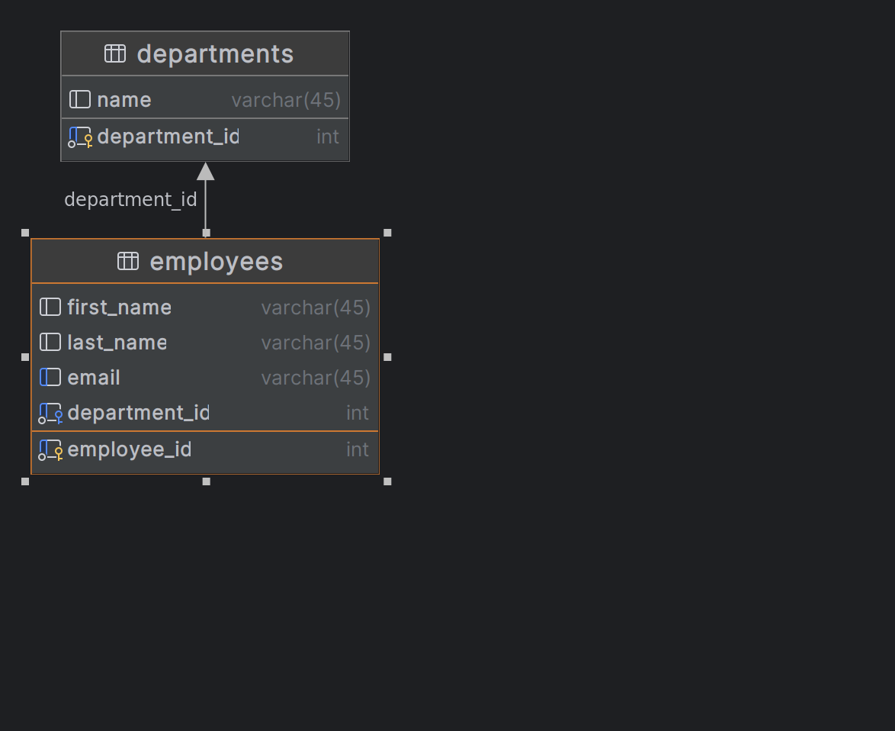

# Employee-REST-API
api to manage employees and there departments

[](https://www.postman.com/satellite-astronaut-99993862/workspace/public/collection/27464457-c34802a6-6197-4d01-9f4c-94acdcf7982b?action=share&creator=27464457)


## Requirements
- Java Development Kit (JDK) 17 or above
- Mysql Database

## How to Run
1. Clone the project repository from Git (if it's not already cloned).
2. Import the project into your favorite Java IDE (e.g., IntelliJ, Eclipse, etc.).
3. Build the project to resolve dependencies.

## ERD



## Schema
```
CREATE DATABASE  IF NOT EXISTS `EMPLOYEE_DIRECTORY`;
USE `EMPLOYEE_DIRECTORY`;

--
-- Table structure for table `employee`
--

DROP TABLE IF EXISTS employees;
DROP TABLE IF EXISTS departments;

CREATE TABLE departments (
department_id INT NOT NULL AUTO_INCREMENT,
name VARCHAR(45) DEFAULT NULL,
PRIMARY KEY (department_id)
)ENGINE=InnoDB AUTO_INCREMENT=1 DEFAULT CHARSET=latin1;

CREATE TABLE employees (
employee_id int NOT NULL AUTO_INCREMENT,
first_name varchar(45) DEFAULT NULL,
last_name varchar(45) DEFAULT NULL,
email varchar(45) DEFAULT NULL unique ,
department_id INT NOT NULL,
PRIMARY KEY (employee_id),
FOREIGN KEY (department_id) REFERENCES departments (department_id)
) ENGINE=InnoDB AUTO_INCREMENT=1 DEFAULT CHARSET=latin1;
```